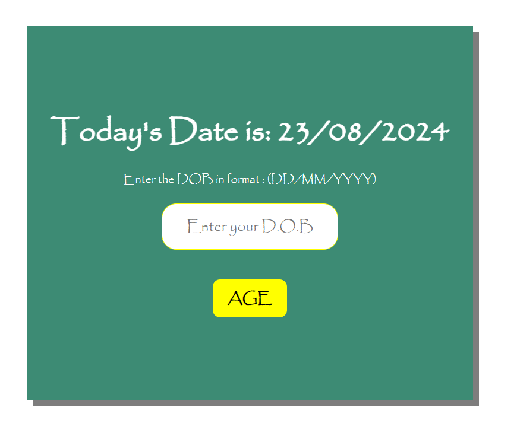
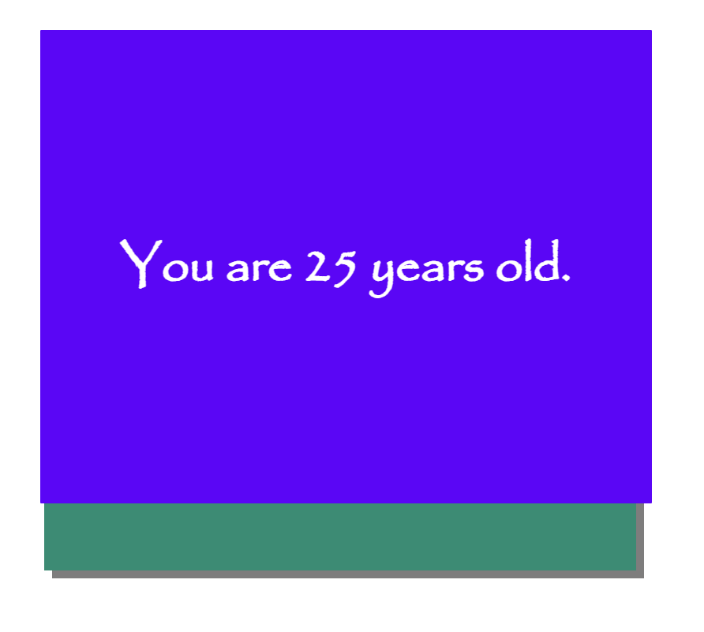

# Welcome 🖐 to the Age Calculator
It is a simple Javascript project which calculates our age in years.

## Default view




### How to use:

---

- Download or clone the repository

```
git clone https://github.com/rbsinh/Age_Calculator.git
```

- Go to the directory
- Run the index.html file
- Enter your DOB and find age..

<br>

## Happy Coding!